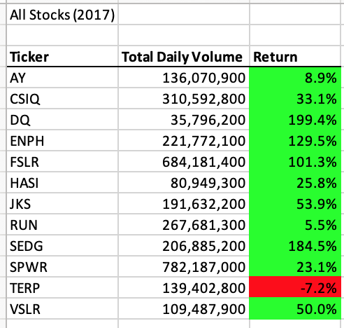
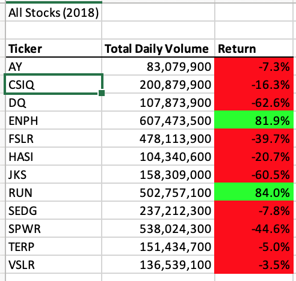
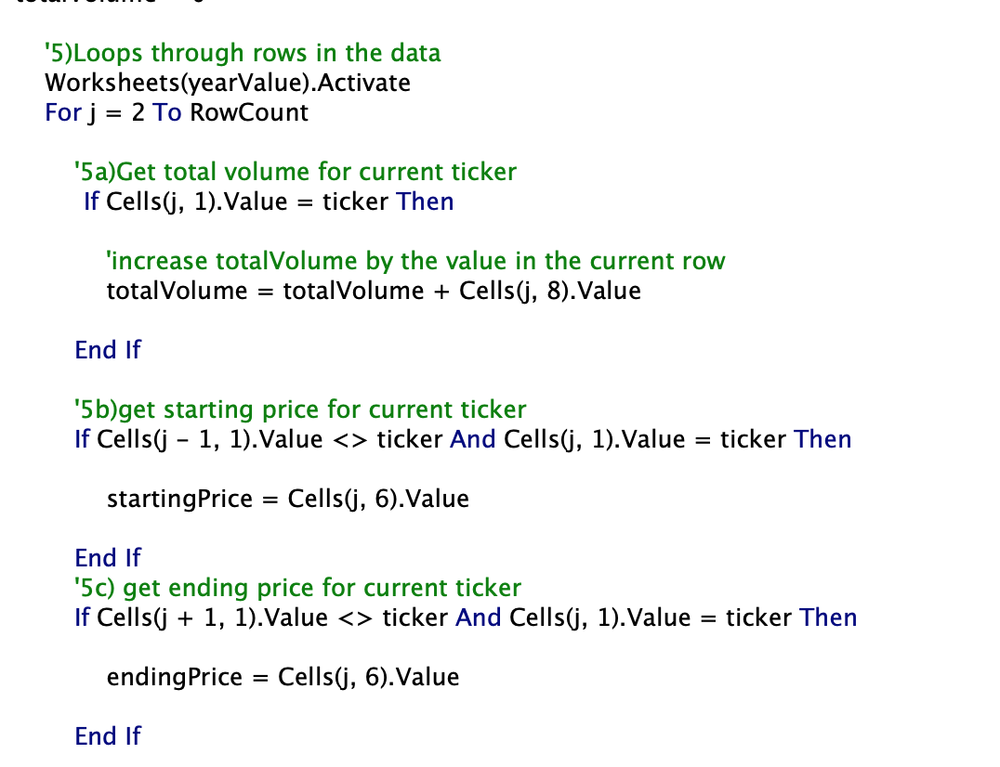
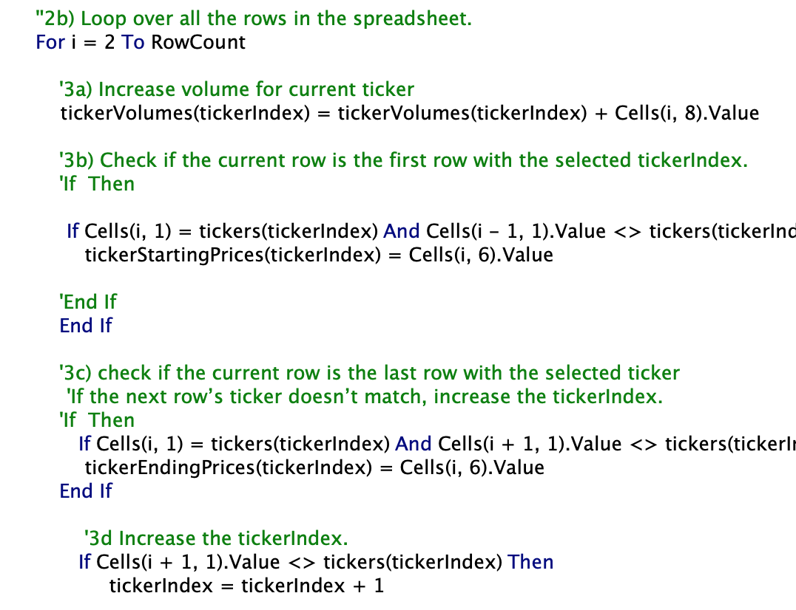

# stock-analysis

## Overview of Project

### Purpose
The purpose of this analysis project was to analyze stocks and their returns for Steve's parents. I performed this twice, originally with nested for loops, and again with refactored code. I then compared the original code and the refactored code run times to see which ran faster for future analysis of larger stock data sets. 
## Results

### Stock Performance
When we calculate the returns on the stocks for both 2018 and 2017, we see that stocks performed better in 2017 than they did in 2018. Additionally when we compare each stock in 2017 and 2018 there is no trend in what stocks performed best. Based of only these 2 years of data it is difficult to tell what stock would be the safest to buy. See below images to see how well the stocks performed in 2017 and 2018. 

### Time Comparison 
When comparing which code is more efficient in analyzing the stocks, we can see that the refactored code runs faster and is much more efficient. This would mean if we were running analysis on thousands of stocks, we would want to use the refactored code rather the original VBA code. In the below screenshots, we see that the refactored code ran twice as fast as the original. 
 
In the below screenshots, we see that the refactored code ran twice as fast again for the 2018 stock analysis. 
 

### Original VBA Code
The original VBA code used nested for loops to summarize the daily volumes for each stock. See below image for the code that was used. 

The refactored code used for loops as well; however I introduced a new variable, "tickerIndex." tickerIndex is used in place of "i" when looping through the data. See below for a visual of the refactored script. 

## Summary 

### Refactoring code Pros and Cons

#### Pros 
Refactoring code can make code more efficient. Because code can become repetitive it tends to be longer. This then makes the time to run the code longer as well. There is also room for more error when we have repeat code such as nested loops. Refactoring makes the script cleaner and easier to read. 
#### Cons 
There may be times where a code needs to be completely redone and refactoring may take time away from fixing it. 

### How this applies to refactoring the original VBA script
In the script that I wrote, I saw that the refactored code looked cleaner and was easier to follow. It also ran faster than the orginal code. I was able to create a more efficient code from an orginal script I had created, which is what makes refactoring so beneficial!
